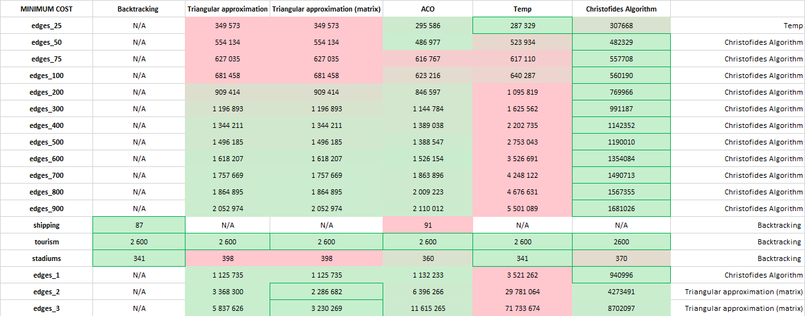
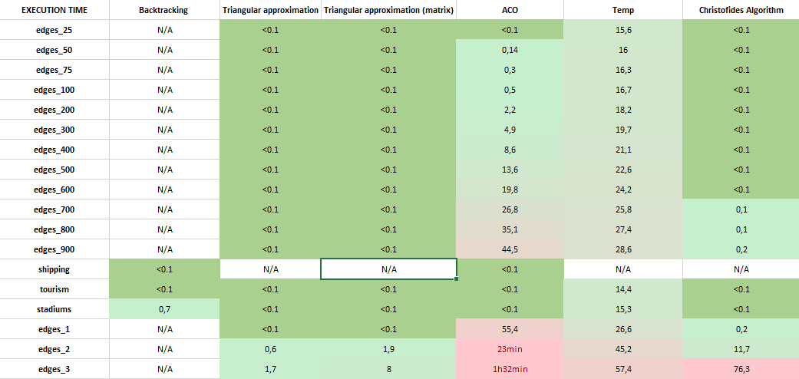

# Algorithm Design-Travelling Salesperson Problem (TSP)

### Description

[Project Description](https://github.com/Mansur-Mustafin/DA-tsp/blob/master/Project2Description.pdf)

Routing Algorithm for Ocean Shipping and Urban Deliveries.  

Analyse the Travelling Salesperson Problem (TSP) and design heuristics to solve it, using several datasets from the context of ocean shipping and urban deliveries. 

### Alrorithms used:
* Backtracking 
* Triangular approximation
* ACO
* Annealing
* Christofieds

### Results:

 <pre>                                   Comparison of Algorithms and their Minimum Cost      </pre>       

&nbsp;
 <pre>                                   Comparison of Algorithms and their Execution Times      </pre>       

&nbsp;

### Contributors and Grade

* [Mansur Mustafin](https://github.com/Mansur-Mustafin) 
* [Francisco Gonçalves de Sousa](https://github.com/FranciscoS0usa)
* [José Nuno Barbosa Quintas](https://github.com/JoseQuintas2021)

Grade: x/20
